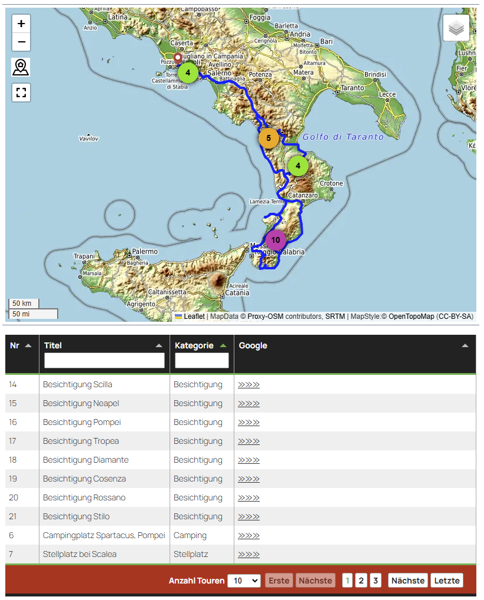

# Post-Map-Table-View

## Description

This plugin displays all WordPress posts or pages containing GPX data (lat, lon) stored in custom fields on an OpenStreetMap map. Posts are categorized using tags, allowing filtering and custom icons. Additionally, a table with all posts is displayed.

Alternatively a descriptive JSON-File in a separate folder may be used to show a map with all destinations you travelled or any other POI you defined in the JSON. 

There is no Admin-Panel to control the plugin. Everything is defined by shortcoder parameters oder settings in JSON-Files.


**Shortcodes:** `[mapview]` — Ready to use. Multiple options available, see table below! Use only once per Page or Post! The generated HTML is stored in transients for improved performance.

`[tourmap tourfolder=<folder relative to upload directory with json-file>]` Will show a nice map and table with all markers you defined in the JSON. This shortocdes requires work with JSON-Files and uploading these with FileZilla. If you don't feel comfortable with that this Plugins is not for you.

For both the Map Tiles for Leaflet may be stored locally on your server!

**NOTE:** Both shortcodes might be used once only per page or post!

## Screenshots

See below and check the example of the plugin in action: [Demo](https://www.berg-reise-foto.de/uebersichtskarte/)

## Usage of [mapview]

### 1. Preparing Posts for the Post-Map shown by [mapview]
#### Add Custom Fields:
- **Lat:** Latitude (use a decimal point as separator)
- **Lon:** Longitude
- Posts with `(0,0)`, invalid, or missing data are ignored.
- To check if all custom fields are set, use the "Admin Columns" WP plugin for better overview.
- Optionally : add **geoadress** taken from nominatim as serialized JSON. Example:
    ```json 
    a:7:{s:7:"village";s:6:"Marktl";s:12:"municipality";s:13:"Marktl (VGem)";s:6:"county";s:20:"Landkreis Altötting";s:5:"state";s:6:"Bayern";s:14:"ISO3166-2-lvl4";s:5:"DE-BY";s:7:"country";s:11:"Deutschland";s:12:"country_code";s:2:"de";}
    ```  
    By using [mapview] the retrieved **geoadress** will be stored as updated metadate to your post.

#### Check Category and Icon Mapping:
Categories are now defined in a JSON file. So it is fully customizable by changing the file. The Icon-PNGs are expected in `/Plugin-Folder/images/` Below is the mapping (which might be changed easily in the settings-file):

| Tag in Post | Category | Icon |
|------------|----------|---------------|
| Trekk | Trekking | hiking.png |
| Bike hike | Bike-Hike | mountainbiking-3.png |
| Radfahren | Cycling | cycling.png |
| MTB | MTB | MTB.png |
| Wander | Hiking | hiking2.png |
| Bergtour | Mountain | peak2.png |
| Skitour | Skiing | skiing.png |
| Paddeln | Kayaking | kayaking2.png |
| (Default) | Travel | campingcar.png |

It is case sensitive!
Simple translate or change according to your site, e.g. translate Tag 'Radfahren' to 'Cycling'. Or Add 'Painting' / 'painting' / 'painting.png'. 

### 2. Displaying the Map
Insert the `[mapview]` shortcode on any page. Use only once per Page or Post!

## Usage of [tourmap]
### 1. Generate JSON-File(s) locally
If you used MapsMarkerPro before: 
- Download the geojson File(s) for the Map. Add at least a 'category' according to the 'category' in file `./settings/category_mapping.json`. Alternatively you might change the file `category_mapping.json` to your tourfolder. If available, this 'local' file will be used for the tourmap.

Write your geojson-File from the scratch. The geojson for ONE Point is like so:
```json
{
    "type": "FeatureCollection",
    "features": [
        {
            "type": "Feature",
            "geometry": {
                "type": "Point",
                "coordinates": [
                    16.7,
                    39.9
                ]
            },
            "properties": {
                "id": "1",
                "name": "Campingplatz im Nationalpark Pollino",
                "text": "Einen Campingplatz im Nationalpark Pollino haben wir nicht gefunden. Das ist schade. Einen Campingplatz im Nationalpark Pollino haben wir nicht gefunden. Das ist schade.",
                "link": "https://www.berg-reise-foto.de/tourenbericht-wanderung/wandern-im-nationalpark-pollino",
                "category": "Stellplatz",
                "image": "https://www.berg-reise-foto.de/smrtzl/uploads/Alben_Website/Wanderung-Gole-del-Raganello/Italien_2018_12-1013-200x150.jpg"
            }
        }
    ]
}

```
I recommend to use [geojson.io](https://geojson.io/#new&map=8.78/48.2514/13.403) to generate the structure of the geojson especially define the coordinates with an interactive map. The required fields in the properties section might be added in the table and content added manually. Additionally you might change the file `category_mapping.json` to your tourfolder. If available, this 'local' file will be used for the tourmap.

### 2. Optional: Prepare one GPX-File
Download from your Track-Cloud / Provider and reduce to the usefull size and content.

### 3. Upload Files to your WordPress-Site
The upload has to be done 'manually' by FileZilla or any comparable tool. Is you prepare the Files locally you will have a backup automatically. 

I recommend to download the file `./settings/category_mapping.json` from the Plugin-Folder if you intend any changes in future. This file will be overwritten with every plugin update. Same procedure for `.htaccess`in `.\leaflet_map_tiles`.

### 4. Add shortcode to page
Use it like so `[tourmap tourfolder=<folder relative to upload directory with json-file>]`. Use only once per Page or Post! For other parameters see table below.

### 5. Screenshot / Demo
Live-Demo on my Site: https://www.berg-reise-foto.de/reisebericht-italien/uebersicht-wohnmobilreise-sueditalien-winter-2022/




## Set Shortcode Parameters
The following parameters are available for both shortcodes (where not all will be used by tourmap).
| Parameter | Default Value | Description | Example |
|-----------|---------------|-------------|---------|
| `numberposts` | 100 | Number of posts to display (maximum : 1000) | - |
| `post_type` | post | Post types (can be an array) | post,page
| `showmap` | true | Show the map |
| `showtable` | true | Show the table |
| `category` | all | Filter by category-slug NOT Name! (case-sensitive, includes child categories) | travel,biking
| `headerhtml` | "" | Custom HTML for table header. Mind restrictions of passing html in shortcode parameters | <h3>Tour Table</h3>
| `gpxfolder` | gpx | Folder containing GPX files | gpx
| `lenexcerpt` | 150 | Length of the excerpt |
| `usewpexcerpt` | false | Use WordPress excerpt |
| `titlelength` | 80 | Max title length |
| `usetileserver` | true | Use tile server |
| `converttiles` | true | Convert tiles to *.webp |
| `contentfilter` | "Kurzbeschreibung:, Tourenbeschreibung:" | Content filter keywords which are removed from the excerpt |
| `tabulatortheme` | tabulator.min.css | Tabulator.js theme from folder ./css. Available are: bootstrap3, bootstrap4, bootstrap5, bulma, materialize, midnight, modern, semanticui, simple, site_dark, site, custom in tabulator_custom.min.css (change this according to your needs) |
| `tablepagesize` | 20 | Number of rows per table page |
| `tableheight` | 0 | Height of the table. 0 is ignored. Used to improve Table load time |
| `mapheight` | "" | Map height in valid CSS units | 800px |
| `mapwidth` | "" | Map width in valid CSS units | 600px |
| `mapaspectratio` | "" | Map aspect ratio as valid CSS | 3/2 |
|-|-|-|-|
| `tourfolder` | tourfolder=tourmap/Italy-2022 | The folder with JSON-Files relative to the WordPress-Uploads-Folder. Used by shortcode [tourmap] only | |
| `trackcolour`| #ff0000 | The colour of the gpx-track on the map, if any| red |
| `trackwidth` | 3 | The width in px of the gpx-track on the map, if any| 3px |
| `mapselector` | OpenStreeMap | The preselected Map | - |
| `mymarkericons` | false | Use another styling for the marker icons if true | - |

## Check Tile Server Settings in .htaccess
Used by both shortcodes.
### Tile Server for Leaflet Map Tiles
Since version 1.0.0, it is also possible to cache the leaflet tiles locally on your own server. This procedure conforms to the guidelines of the osmfoundation (https://operations.osmfoundation.org/policies/tiles/). There is no bulk download and the maps are stored locally. The Http referrer of the current request is used as the Http referrer. 
In addition the visitor's IP is NOT forwarded to the map server. This ensures that the use of maps from OpenStreeMap complies with the General Data Protection Regulation EC 2016/679. Therefore, no notice is required in the privacy policy of the website. This option can be set via shortcode parameter. Furthermore, the conversion of the tiles into webp file format can be chosen in order to meet Google Pagespeed requirements.
**Note:*** The file ./the-plugin-folder/leaflet_map_tiles/.htacces has to be changed for the correct path and stored locally. Currently it will be overwritten with every Plugin-Update. So restore it manually afterwards.
```PHP
    ... content of .htaccess in ../the-plugin-folder/leaflet_map_tiles
    # Change only the next according to your server 
    RewriteBase /wordpress/wp-content/plugins/the-plugin-folder/leaflet_map_tiles/
    # Do not change after this line
```
Drawback: No fileage clean-up implemented. So, once stored, the tiles are used forever. Currently, only a manual deletion works which forces a new download of the tiles.

## Upgrade Notice

Upgrade is recommended. Preparation of Release is still missing.
**ATTENTION** Your changes in `category_mapping.json` will be overwritten! Safe this file and `.htaccess` locally prior to updating.

## I18N

 Status with wp solution: npm make-pot and wp i18n make-pot do not pass translation comments and flags to the pot- and po- files. 
 Mo files are binary reduced to the minimum, so no comments included by definition.
 Tested workflow: Generate the pot with eazy po and translate the pot with poedit. Generate the mo files with poedit.
 But: there is no WP built in function to load comments and flags into php or js. So, this had to be written by me.
 Finally the frontend is translated in the client for tabulator and leaflet where the translations are hardcoded in js.
 The PHP error messages are translated in PHP by the WP standard way.

## Installation

1. Download the Release. Do not use the zip of the repository. This won't work (due to webpack transpilation).
2. Install via the standard WP method (Upload zip in Admin Dashboard).
   - If already installed, remove the old version first! No additional directories or database entries will be deleted.
3. Activate the plugin through the "Plugins" menu in WordPress.
4. Done! No further settings required.

## Deinstallation
- Use the standard method of WordPress.

## Changelog

### 1.2.0 (01.03.2025)
Translation process updated, see I18N. Automatic generation of .htaccess file added.

### 1.1.0 (26.02.2025)
Translation for en, it, es, fr included. Translation for Tabulator.js is done in the frontend (for leaflet it what so before). Prerequisite: The html content has to be in English. 
Therefore the language in PHP is set to en_US. Further translations have to be added in JS-code and not in po-, mo-files.

### 1.0.1 (16.02.2025)
- CSS-File Clean-up: small main css is loaded in PHP. Reason for red clusters removed. grid prepared but not used.

### 1.0.0 (14.02.2025)
- TBD, see github changelog.

### 0.10.5 (14.05.2022)
- Tested with WordPress 6.0

### 0.10.4 (02.02.2022)
- Minor PHP warning correction to satisfy PHPStan (level 5) and QueryMonitor

### 0.10.3 (30.01.2022)
- Replaced Bike-Hike-Map with CycleOSM

### 0.10.2 (16.01.2022)
- Minor PHP bugfix

### 0.10.1 (13.01.2022)
- CSS changes for new theme
- Readme update

### 0.10.0 (30.11.2021)
- Switched to tabulator.info

### 0.9.1 (18.11.2021)
- Introduced and tested transients for PHP -> JS variable `$postArray`

### 0.9.0 (16.11.2021)
- Reworked flexible icons and groups provided by PHP script
- Tours are now passed to JS as a variable

### 0.8.1 (08.11.2021)
- Added 'tab: false' for Safari to open pop-ups correctly

### 0.8.0 (30.03.2021)
- Added a table to show all posts under the map
- Bootstrap-table used for rendering
- Full functionality not guaranteed with the "Photo Perfect Pro" theme
- Fixed leaflet loading issue (ensuring it loads only once)
- All files now loaded locally
- Passed variable `g_wp_postmap_path` to JS using `localize_scripts`
- Introduced transients to store the generated HTML output (re-generated if a new post is published)

### 0.7.0 (17.02.2021)
- PHP 8 compatibility check (OK, no changes needed)
- Replaced `jQuery` with `$`
- Run JS only if `div 'map10_img'` is present

### 0.6.0 (09.01.2021)
- Mobile improvement: Hide zoom controls on mobile devices

### 0.5.0 (28.12.2020)
- Speed improvement: Optimized excerpt function (uses `<p>` abstracts only)
- Replaced function for converting tags to strings with an anonymous function

### 0.4.0 (14.12.2020)
- Introduced namespace

### 0.3.0 (01.04.2020)
- Initial release

## Credits

This plugin utilizes the following libraries and resources:
- [Leaflet](https://leafletjs.com/)
- [Leaflet MarkerCluster](https://github.com/Leaflet/Leaflet.markercluster)
- [Map Icons](https://mapicons.mapsmarker.com/)
- [Tabulator](https://tabulator.info/)
- [geojson.io](https://geojson.io/#new&map=8.78/48.2514/13.403) for generating geojson File with Points
